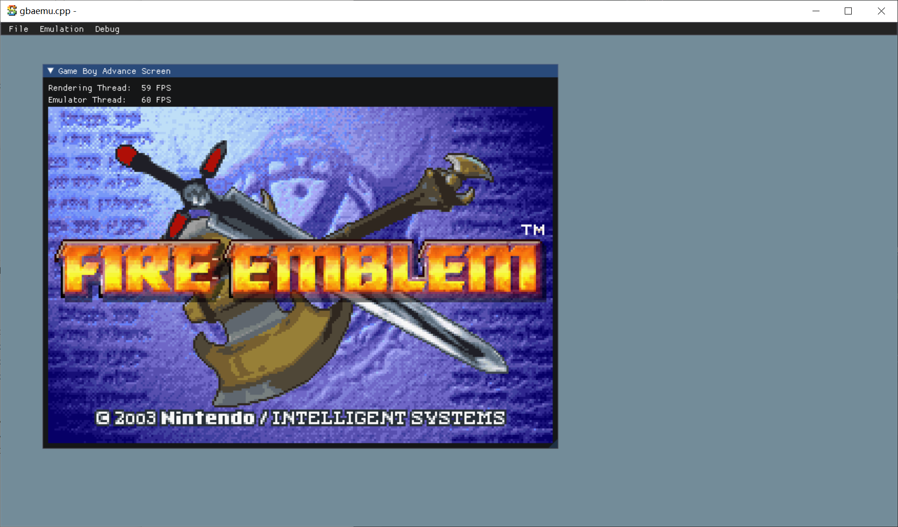

# gbaemu.cpp
NES emulator in cpp 

Frontend: sokol
EmuCore: ecnavdA-yoBemaG (slightly modified)

# screenshots

# build requirements

Any modern 64 bit OS

- Linux
  - gcc or clang
  - GTK3 development libraries (for nativefiledialog-extended)
- Windows
  - Only `clang-cl` will work. No MSVC.
    - ecnavdA-yoBemaG using `__attribute__((packed))` and heavily using switch range-case

# links

- https://github.com/KellanClark/ecnavdA-yoBemaG
- https://github.com/floooh/sokol

other awesome-gba

- https://github.com/gbadev-org/awesome-gbadev
- https://github.com/mgba-emu/mgba
- https://github.com/skylersaleh/SkyEmu
- https://github.com/erkkah/tigr
